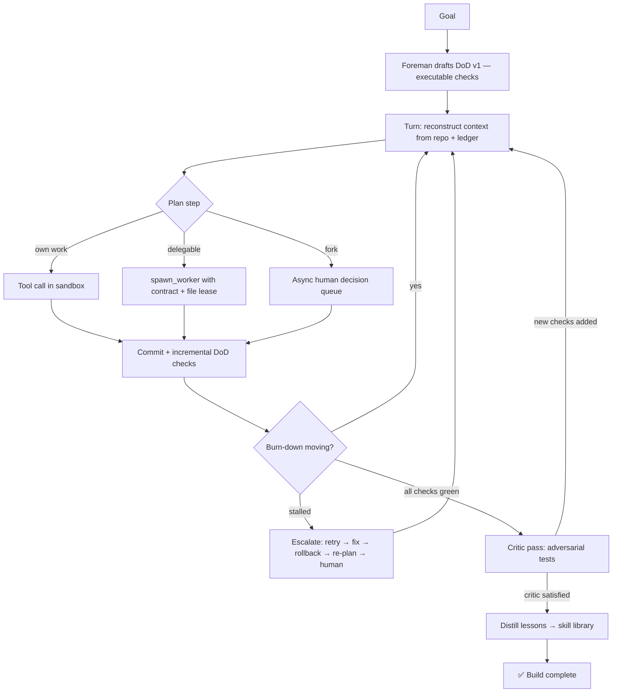

# ⚡ Aether v3 — Foreman Mode

A single locus of intent with ephemeral specialist workers, a git-backed memory, continuous verification, and an adversarial Critic.

---

## The Three Principles

| Principle | What it means |
|---|---|
| **Repo is the mind** | State lives in git, not the transcript. Every write commits. Context is reconstructed from the ledger each turn — history is bounded and disposable. |
| **Verification is continuous** | DoD checks run incrementally after every write. The dashboard shows a live burn-down chart. Flat burn-down auto-triggers strategy escalation. |
| **Agents are ephemeral** | Workers are spawned as tools, run in parallel with file leases, return a diff, and die. One mind holds the plan; many hands do the work. |

---

## Architecture

```
siniaq/
├── server.js                      Express + WebSocket bridge
├── skill-library.json             Cross-build persistent lessons (auto-created)
├── src/
│   ├── foreman.js                 The Foreman — single locus of intent
│   ├── ledger.js                  Git-backed Project Ledger (structured state)
│   ├── dod-runner.js              Continuous DoD executor + burn-down + stall detection
│   ├── critic.js                  Adversarial Critic (additive-only DoD amendments)
│   ├── worker.js                  Ephemeral worker spawner with file-lease enforcement
│   ├── failure-classifier.js      Failure taxonomy + 5-rung escalation ladder
│   ├── skill-library.js           Cross-build lesson distillation and retrieval
│   └── tools/
│       └── index.js               Foreman toolbox (incl. spawn_worker, amend_dod, rollback)
└── public/                        4-column live dashboard
    ├── index.html                 Layout: Goal/DoD | Log | Workers/Critic | Queue/Stats
    ├── style.css                  Dark UI with burn-down chart
    └── app.js                     WebSocket listener + all v3 event handlers
```

---

## The Foreman Loop



---

## New Tools (v3)

| Tool | Description |
|---|---|
| `spawn_worker` | Delegate parallelisable subtasks to ephemeral workers with file leases |
| `amend_dod` | Add checks to the DoD (additive-only; scope reductions need human sign-off) |
| `rollback` | `git checkout` to the last `dod-green` tag |
| `queue_question` | Post async question — build continues, human answers in the queue panel |
| `read_ledger` | Read decisions, constraints, failed approaches, DoD state |
| `update_ledger` | Write decisions/constraints/failed approaches to the ledger |

---

## What's New vs v2

| Feature | v2 (Architect) | v3 (Foreman) |
|---|---|---|
| **Memory** | In-memory scratchpad (lost on crash) | Git-committed ledger (survives anything) |
| **Rollback** | None | `git checkout dod-green` |
| **Verification** | End-loaded (verify once at claim of completion) | Continuous (after every write) |
| **Thrash detection** | None | Burn-down slope — flat for N turns = escalate |
| **Workers** | Serial (Foreman types everything) | Parallel ephemeral workers with file leases |
| **Second perspective** | None | Adversarial Critic (additive-only DoD power) |
| **Failure handling** | Log-stuffing (all failures treated equally) | Taxonomy + 5-rung escalation ladder |
| **Human gate** | Blocking `ask_human` (world stops) | Async decision queue (build continues) |
| **Cross-build learning** | Starts cold every build | Skill library — retrieves relevant lessons at start |

---

## Getting Started

### 1. Prerequisites
- Node.js ≥ 18
- Git (must be on PATH — the Foreman uses it to commit workspace state)

### 2. Install
```bash
npm install
```

### 3. Configure
```env
# .env
ANTHROPIC_API_KEY=sk-ant-...
PORT=3000

# Optional
CRITIC_MODEL=claude-haiku-4-5   # defaults to same model as Foreman
MAX_WORKERS=3                    # max parallel workers (default: 3)
```

### 4. Run
```bash
npm run dev       # with live reload
# or
npm start
```

### 5. Open
**[http://localhost:3000](http://localhost:3000)**

Enter a goal in the left panel and click **Begin Build**.

---

## Dashboard Panels

| Panel | Contents |
|---|---|
| **Goal / DoD** | Goal input, Definition-of-Done checklist, live burn-down spark-line |
| **Decision Log** | Turn-by-turn Foreman reasoning, tool calls, results (filterable) |
| **Workers** | Spawned worker cards with status, task, file lease, and summary |
| **Critic** | Adversarial verdict, new checks added, test files written |
| **Decision Queue** | Async human questions — answer without stopping the build |
| **Stats** | Turn count, tool calls, workers spawned, elapsed time |
| **Workspace** | Files written to the build workspace |

*verified by vibecheck*
# siniaq
