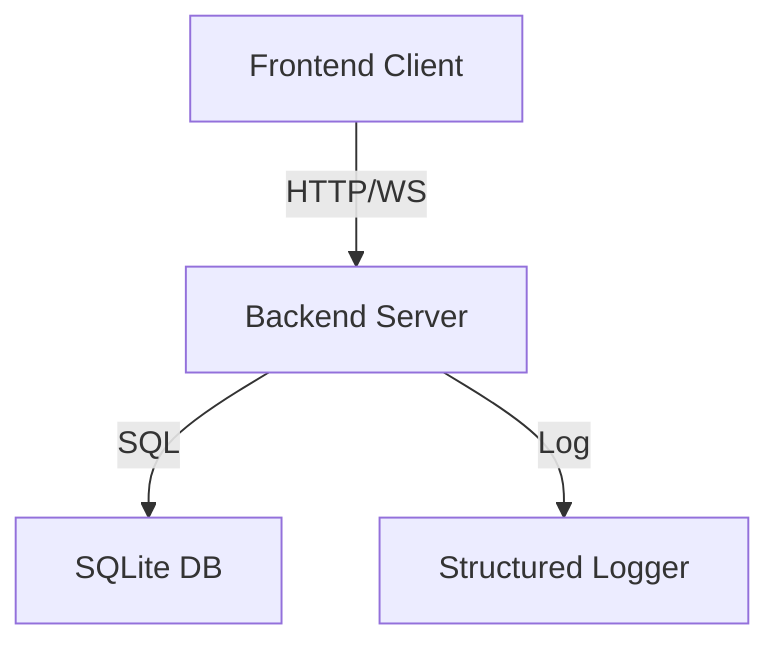

# System Architecture Design
## Component: build web app to deploy mitm creds grabber reverse proxying target website through user owned domain on platform Cloudflare workers

```mermaid
graph TD
  Client[Frontend Client] -->|HTTP/WS| Server[Backend Server]
  Server -->|SQL| Database[SQLite DB]
  Server -->|Log| Logger[Structured Logger]
```